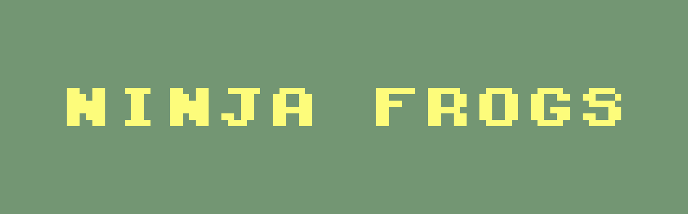
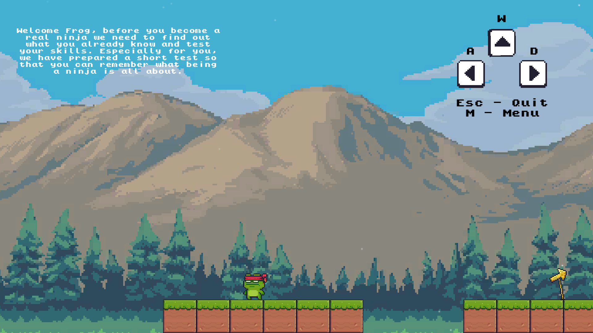
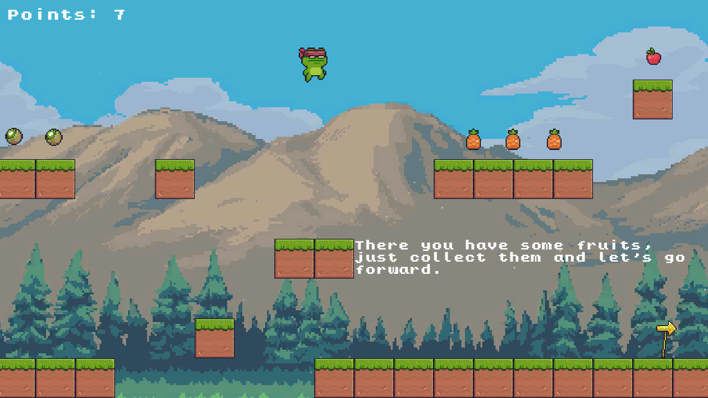
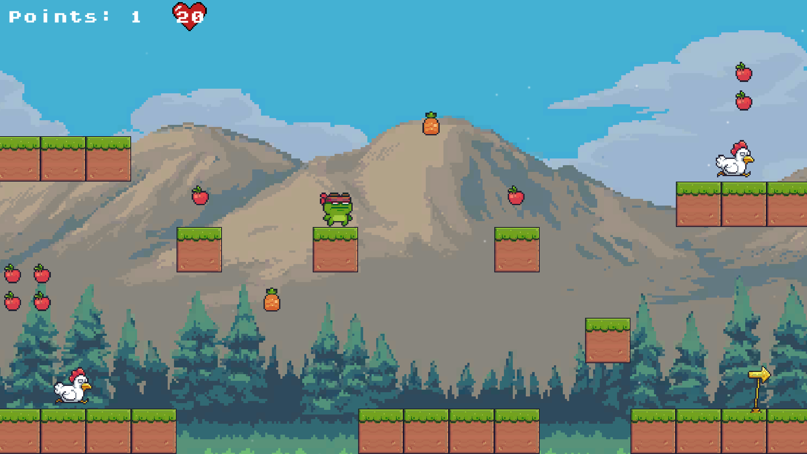
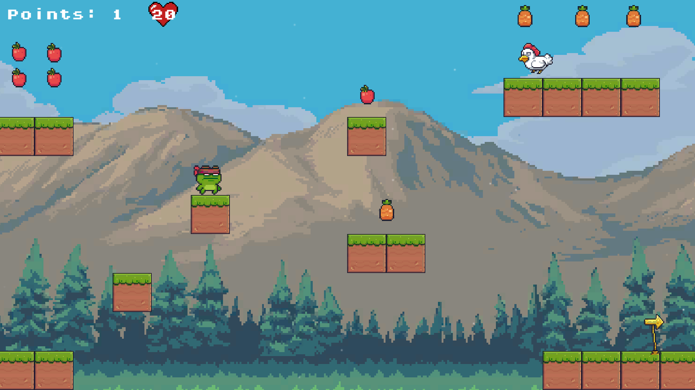
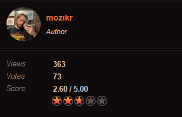

## Ninja Frog

### Made with C# and Unity Engine

My first self-made game, made in 2021. 

<h2 align="center">Story :scroll: </h2>

It is a simple 2D platformer. Ninja Frog is about a young frog which really wants to become the best ninja on the frog planet. You can try to help making his dream come true.

Unity Developer: Szymon Mozol

<table>
<tr>
    <td>

</td>
    <td>

</td>
</tr>
    <tr>
    <td>

</td>
    <td>

</td>
</tr>
</table>

<h2 align="center">Ratings :trophy: </h2>

Rating on newgrounds

<table>
<tr>
    <td>

</td>
</tr>
</table>

<h2 align="center">Download</h2>

    Click here to download <a href="https://mozikr.itch.io/ninja-frog">Ninja Frog</a>

